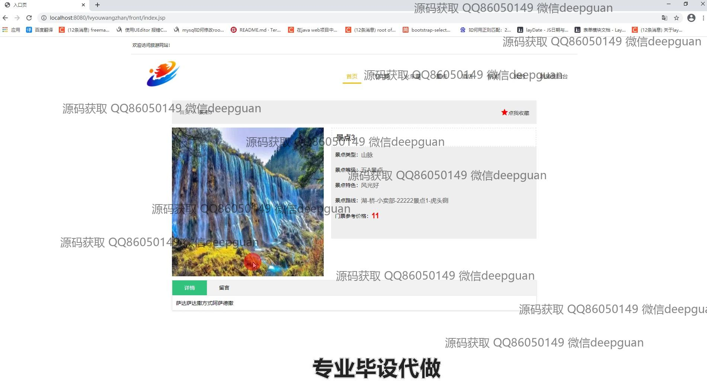
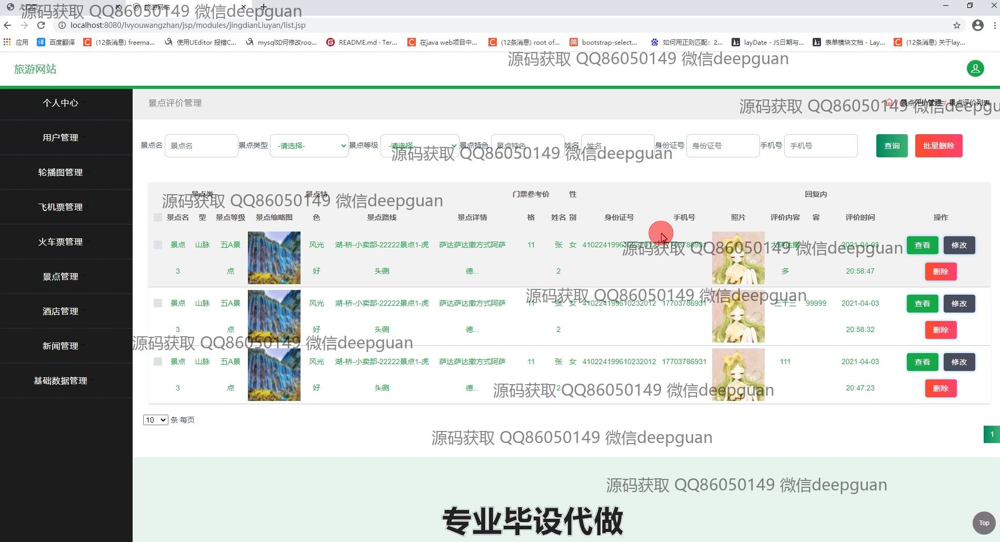
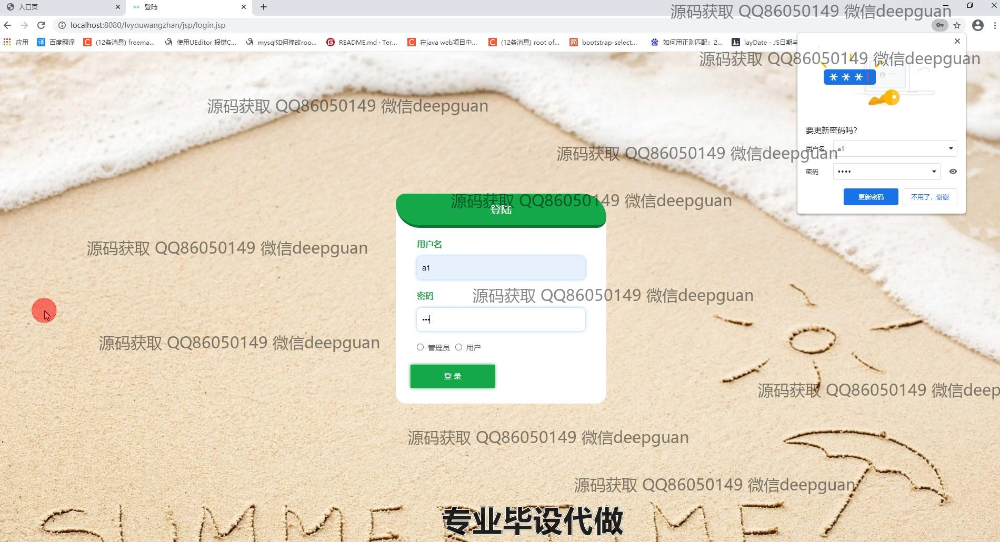
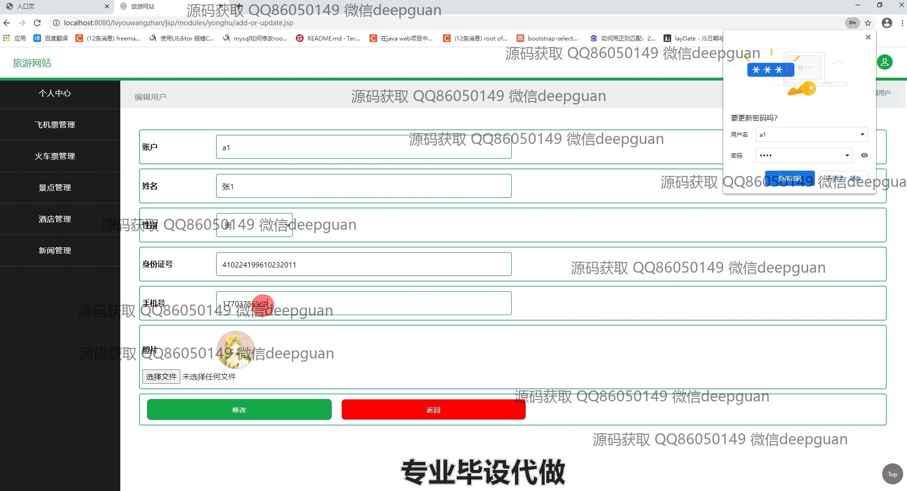

<h1 align="center">旅游网站的设计与实现</h1>

## 简介
旅游网站：角色分为管理员、用户；功能包括酒店订单管理、用户注册与登录、机票与火车票预订、景点详情与评论、后台管理模块、新闻和留言互动。    --计算机毕业设计源码；毕设源码；java毕业设计源码

## 联系方式

<h3 align="center">获取完整代码与数据库文件 + 微信：deepguan QQ: 86050149 QQ群: 783742310</h3>

<h3 align="center">可帮忙远程部署 包运行成功！提供远程部署、修改代码、设计文档指导、代码讲解等服务！</h3>

## 功能介绍（完整见运行截图）
管理员：基本功能包括登录、注册和退出，支持后台管理界面操作。后台模块包含用户管理、景点管理、酒店管理、机票管理、火车票管理、新闻管理和轮播图管理，支持添加、查看、修改、删除功能。管理员可管理用户信息、订单详情及评论回复，并支持景点评价管理和酒店留言管理等交互功能，提供高效的资源操作和数据维护。

用户：基本功能包括注册、登录和退出，个人中心可编辑账户信息，查看订单、收藏和留言。网站首页提供热门旅游目的地推荐、新闻展示和图片轮播，方便用户获取最新旅游信息。用户可通过机票、火车票、景点、酒店等模块进行搜索、预订、收藏及查看详细信息，同时支持在线评论与互动，提升用户体验。

游客：无需登录即可浏览网站首页和部分功能模块，包括查看热门推荐、新闻展示和旅游资源。支持景点详情查看、航班和火车票信息预览，以及酒店预订信息查询，为游客提供便捷的旅游信息获取渠道。

客服：通过后台系统协助管理用户留言、订单投诉及反馈，支持问题回复和状态跟踪。可根据用户需求优化信息展示和互动流程，提升服务质量与用户满意度。

## 运行截图

本代码来源于网络,仅供学习参考使用!

